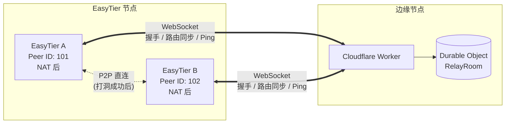

# 🌐 EasyTier WebSocket Relay

[](https://deploy.workers.cloudflare.com/?url=https://github.com/EasyTier/easytier-ws-relay)

[](https://console.cloud.tencent.com/edgeone/pages/new?template=easytier-ws-relay)

基于 Cloudflare Workers 和 EdgeOne Pages 的 **无服务器 WebSocket 中继服务**，为 [EasyTier](https://github.com/EasyTier/EasyTier) 去中心化 P2P 网络提供高性能的信令转发与路由同步。

---

## ✨ 特性

- 🌍 **全球边缘加速** — 基于 Cloudflare 300+ 边缘节点，就近接入，毫秒级延迟
- 🔒 **端到端加密** — 支持 AES-128/256-GCM 加密，网络密钥派生，确保数据传输安全
- ⚡ **Serverless 架构** — Cloudflare Durable Objects 持久化状态，自动扩缩容，零维护成本
- 📡 **OSPF 风格路由** — 连接位图 (connBitmap) + 增量路由同步，高效发现 P2P 路径
- 📦 **Protobuf 二进制协议** — 使用 Protocol Buffers 编码，体积小、解析快
- 👥 **多方通信** — 同一房间内所有 EasyTier 节点可互相发现和通信
- 🎨 **精美主页** — 内置暗色/亮色主题、中英文切换的 Landing Page

## 📖 原理

### 架构图



### 工作流程

1. **WebSocket 连接** — EasyTier 节点通过 WebSocket 连接到 Cloudflare Worker
2. **房间路由** — 根据 `?room=network_name` 参数，请求被路由到对应的 Durable Object 房间
3. **握手注册** — 节点发送 HandShake 包，包含网络名称和密钥摘要，完成注册和分组隔离
4. **路由同步** — RelayRoom 维护同组内所有 Peer 的连接信息，通过 OSPF 风格的 `SyncRouteInfo` 协议广播路由更新
5. **消息转发** — 当节点需要与另一个 NAT 后的节点通信时，通过 Relay 转发控制消息和路由信息
6. **P2P 打洞** — 节点获取到对方的外网信息和连接位图后，尝试建立直接 P2P 连接

### 核心模块

| 模块 | 文件 | 功能 |
|------|------|------|
| Worker 入口 | `src/worker.js` | 处理 HTTP/WebSocket 请求，路由到 Durable Object |
| RelayRoom | `src/worker/relay_room.js` | Durable Object，管理房间内的 Peer 连接和消息路由 |
| PeerManager | `src/worker/core/peer_manager.js` | 维护 Peer 元信息、路由会话、连接版本 |
| RpcHandler | `src/worker/core/rpc_handler.js` | 处理 PeerCenterRpc 和 OspfRouteRpc |
| BasicHandlers | `src/worker/core/basic_handlers.js` | 握手、心跳、消息转发 |
| Crypto | `src/worker/core/crypto.js` | SipHash/AES-GCM/SHA256 加密 |
| Protocol | `protos/` | EasyTier 二进制协议定义 (Protobuf) |

## 🚀 快速开始（使用公共中继）

在 EasyTier 配置文件中添加：

```toml
# ~/.easytier/config.toml
[relay]
url = "wss://easytier-ws-relay.example.workers.dev/ws?room=my-network"
```

或通过命令行：

```bash
easytier-core --relay "wss://easytier-ws-relay.example.workers.dev/ws?room=my-network"
```

> ⚠️ 请确保你和同伴使用相同的 `room` 名称。不同房间的节点互相隔离。

## 📦 自部署

### 一键部署到 Cloudflare Workers

点击下方按钮，一键部署到你自己的 Cloudflare 账号：

[](https://deploy.workers.cloudflare.com/?url=https://github.com/EasyTier/easytier-ws-relay)

### 手动部署

#### 前置条件

- [Node.js](https://nodejs.org/) >= 16
- [pnpm](https://pnpm.io/) (推荐) 或 npm
- [Cloudflare 账号](https://dash.cloudflare.com/sign-up)
- [Wrangler CLI](https://developers.cloudflare.com/workers/wrangler/install-and-update/)

#### 部署步骤

```bash
# 1. 克隆项目
git clone https://github.com/EasyTier/easytier-ws-relay.git
cd easytier-ws-relay

# 2. 安装依赖
pnpm install

# 3. 登录 Cloudflare
npx wrangler login

# 4. 部署
npx wrangler deploy
```

部署完成后，你的中继地址将是 `https://easytier-ws-relay-worker.<your-subdomain>.workers.dev/ws`

> 💡 部署后访问部署域名即可看到 WebSocket 中继的 Landing Page。

### 部署到 EdgeOne Pages

#### 前置条件

- [EdgeOne Pages 账号](https://console.cloud.tencent.com/edgeone/pages)
- [EdgeOne CLI](https://www.npmjs.com/package/edgeone) (可选，CLI 部署)
- [Go](https://go.dev/) >= 1.22 (Go Cloud Function)

#### 部署步骤

1. **Fork 或克隆本项目**

2. **在 EdgeOne Pages 控制台导入项目**
   - 登录 [EdgeOne Pages 控制台](https://console.cloud.tencent.com/edgeone/pages)
   - 点击「新建项目」→「导入 Git 仓库」
   - 选择本项目仓库

3. **配置构建设置**

   | 配置项 | 值 |
   |--------|-----|
   | 框架预设 | 自定义 |
   | 构建命令 | (留空，使用 Go Cloud Functions) |
   | 输出目录 | (留空) |
   | Node.js 版本 | 20+ |

4. **部署**
   - 点击「保存并部署」

> 📘 项目 `cloud-functions/` 目录下的 Go 代码会自动部署为 EdgeOne Cloud Functions，实现 WebSocket 中继功能。

5. **（可选）使用 CLI 部署**

   ```bash
   # 安装 EdgeOne CLI
   npm install -g edgeone

   # 登录
   edgeone login

   # 部署
   edgeone pages deploy
   ```

## 🔧 开发

```bash
# 本地开发（监听所有网络接口）
pnpm dev

# 仅本地开发
pnpm start

# 生成 Protobuf 代码
npx pbjs -t static-module -w es6 -o src/worker/core/protos_generated.js protos/*.proto
```

### 项目结构

```
easytier-ws-relay/
├── src/
│   ├── worker.js              # Worker 入口 & Landing Page
│   └── worker/
│       ├── relay_room.js       # Durable Object: RelayRoom
│       └── core/
│           ├── basic_handlers.js  # 握手/Ping/转发
│           ├── compress.js        # gzip 压缩
│           ├── constants.js       # 常量定义
│           ├── crypto.js          # 加密模块
│           ├── packet.js          # 二进制包头
│           ├── peer_manager.js    # Peer 管理
│           ├── protos.js          # Protobuf 加载
│           ├── protos_generated.js # 生成的 Proto 代码
│           └── rpc_handler.js     # RPC 处理
├── protos/                    # Protocol Buffers 定义
├── cloud-functions/           # EdgeOne Go Cloud Functions
├── docs/                      # VitePress 文档
├── wrangler.toml              # Cloudflare 部署配置
├── package.json
└── README.md
```

## 🔒 安全

- **分组隔离** — 通过 `networkName:networkSecret` 的 SHA256 哈希形成 groupKey，不同网络密钥的节点完全隔离
- **可选加密** — 支持 AES-128-GCM 和 AES-256-GCM，在 `wrapPacket` 中根据配置决定是否加密
- **无状态中继** — 中继服务不存储任何用户数据，仅作信令转发

## 📄 协议

EasyTier 使用自定义的 16 字节二进制包头：

```
┌────────────┬────────────┬──────────┬───────┬────────────────┬──────────┬─────┐
│ fromPeerId │  toPeerId  │ pktType  │ flags │ forwardCounter │ reserved │ len │
│   (4B)     │   (4B)     │  (2B)    │ (1B)  │    (1B)       │  (2B)   │ (2B)│
└────────────┴────────────┴──────────┴───────┴────────────────┴──────────┴─────┘
```

详见 [EasyTier 项目](https://github.com/EasyTier/EasyTier)。

## 🤝 贡献

欢迎提交 Issue 和 Pull Request！

## 📜 许可证

[MIT License](LICENSE)
